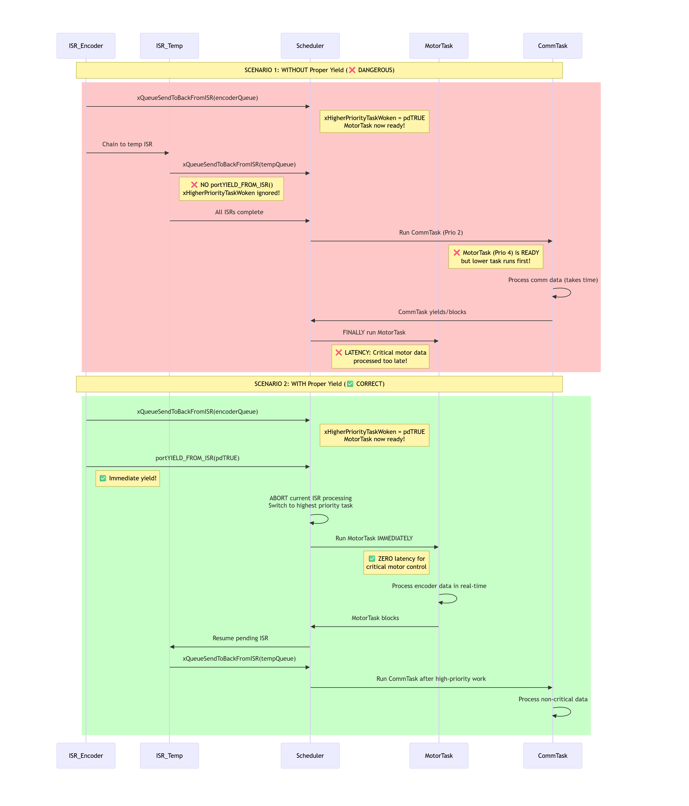

# introduction to freertos

## nomen

- ISR: interrupt service routine

## 2 freertos kernel distribution

**freertos port**: combination of compiler and processor

**FreeRTOSConfig.h**: kernel configuration, dependency of `FreeRTOS.h`

**common source files**:

| name            | necessity      | description                                     |
| --------------- | -------------- | ----------------------------------------------- |
| tasks.c         | required       | ?                                               |
| list.c          | required       | ?                                               |
| queue.c         | often required | queue and semaphore services                    |
| timers.c        | optional       | software timers                                 |
| event_groups.c  | optional       | ?                                               |
| stream_buffer.c | optional       | ?                                               |
| croutine.c      | rarely used    | coroutines for extremely small microcontrollers |

**port-specific source files**:

- portable/< compiler >/< architecture >/
- portale/MemMang/: impl of heap allocation schemes

**user defined types**:

- TickType_t: type of tick count which is used to measure time. configured by `configTICK_TYPE_WIDTH_IN_BITS`. needed to comply to arch's bits
- BaseType_t: with bits often equals to arch's bits

> deprecation: configUSE_16_BIT_TICKS is deprecated by configTICK_TYPE_WIDTH_IN_BITS

**naming convention**:

- (leading) 'p': pointer type
- (leading) 'u': unsigned type
- 'v': void
- 'c': char
- 's': short
- 'l': long
- 'x': BaseType_t, struct, handles, etc.
- functions: < ret type >< **S**rc file name >< **F**unctionality >
- private functions: < prv >...
- macros: (port|task|pd|config|err)< NAME >

> pd: project definition

> a handle is a pointer (?)

## 3 heap management

how to use dynamic allocation: set `configSUPPORT_DYNAMIC_ALLOCATION`; api: `pvPortMalloc` and `vPortFree`

**example implementations(heap_x.c)**:
1. no reuse
2. reuse with fixed block size
3. wrapping malloc() and free()
4. combines adjacent blocks
5. support separated physical spaces

defining heap:

- configTOTAL_HEAP_SIZE
- configAPPLICATION_ALLOCATED_HEAP: up to user to define ucHeap(the heap instance)

heap monitoring:
- xPortGetFreeHeapSize()
- xPortGetMinimumEverFreeHeapSize()
- vPortGetHeapStats()
- vTaskGetInfo()
- configUSE_MALLOC_FAILED_HOOK: if set, requires implemntation `void vApplicationMallocFailedHook(void)`
- fast stack alloc:...

static alloc:...

## 4 task

**task function behavior**: of type `void funct_t`, never returns, otherwise use `vTaskDelete(NULL)` inside function to end itself

**task states**:
- not running
  - suspended: suspended purposefully
  - blocked: the state awaiting event
  - ready: that can be selected to run by the scheduler
- running

**related functions**: 
- `xTaskCreate(pv func, pc name, u stack depth, pv parms, ux pri, px task_handle|NULL)`, `vTaskStartScheduler()`
- `vTaskPrioritySet(x task_handle, pri)`, `uxTaskPriorityGet(p task_handle)->pri`
- `vTaskDelete(px task_handle|NULL)`
- `vTaskDelay(ticks)`, `vTaskDelayUntil(p prev_tick, ticks)`
- `vTaskSuspend`, `vTaskResume`

> `pdMS_TO_TICKS`

**scheduler behavior**: select highest priority having task(s) - > execute a task for a tick(time-slice)(depends on configTICK_RATE_HZ). **preemption** means a higher task get ready when a lower task is running and immediately runs, configured by `configUSE_PREEMPTION`; to select task with same priority: `configUSE_TIME_SLICING` set: to select earliest ended(in-turn), unset: to select latest ended(indefinite until) 


hooking idle:...

task local storage(TLS): ...

cooperative scheduling:...

## 5 queue

**motivation of queue**: provide (task|interrupt)-(task-interrupt) communication, facilitate sender/receiver design mode

**related functions**:
- `xQueueCreate(ux length, ux item_size)->handler`
- `xQueueSendToFront(x queue, pv item, ticks)->SUCCESS`, `xQueueSendToBack(...)`, `xQueueReceive(...)`, `xQueuePeak(...)`
- `uxQueueMessagesWaiting(x queue)`
- `xQueueOverwrite(queue, pv item)`

> never recv queue from interrupt routine

tips on working with multiple sender, working with data in scale:...

### queue set
> use configUSE_QUEUE_SETS to enable queue set

**motivation**: to receive from multiple queues

**related functions**:
- `xQueueSetCreate(ux length)->queue_set_handle`
- `xQueueAddToSet(member_handle_t queue_or_semaphore, queue_set)->SUCCESS`
- `xQueueSelectFromSet(queue_set, ticks)->member_handle`

## 6 timer
> timer is a daemon task(service), receiving manipulations via queue

> configUSE_TIMERS to enable timer util, configTIMER_TASK_PRIORITY for service priority, configTIMER_QUEUE_LENGTH for number of timers, configTIMER_TASK_STACK_DEPTH for service stack 

**callback function behavior**: of type `void ATimerCallback(TimerHandle_t xTimer)`; either one-shot or auto-reload, in state dormant or running;

**related functions**:
- `xTimerCreate(pc name, period, bool auto_reload, pv id, px callback)->handle`, `xTimerDelete(handle, ticks)->SUCCESS`
- `xTimerStart(handle, ticks)`, `xTimerStop(handle, ticks)`
- `vTimerSetTimerID(handle, pv id)`, `pvTimerGetTimerID(handle)`
- `xTimerChangePeriod(handle, period, ticks)`
- `xTimerReset(handle, ticks) // reset timer counting and timer state to running`

> callback incoperates in the daemon task, thus should not make task blocked


## 7 interrupt

> freertos provides features to allow specific event processing strategy *to be implemented*

> the part of api suffixed with `FromISR` can be called from interrupt service, otherwise do not. this separate interrupt-safe api can avoid hardware-os interference, although it can not control behavior of 3rd party used in isr. to issue this: 1. delegate interrupt to task 2. mendate FromISR api(?). `FromISR` api replaces `ticks` parameter with `px HigherPriorityTaskWoken` compared to its counterpart.

**api behavior in interrupt**: unlike api being called from task, when api is called from isp, context switch is not performed and scheduler do not try to switch to higher priority task unless `portYIELD_FROM_ISR(true)` iscalled 

> `portEND_SWITCHING_ISR` is the same as `portYIELD_FROM_ISR` but deprecated (?)

**delegating interrupt to task** passes data by (ISR send by queue)->(scheduling in api)->(task recv). `portYIELD_FROM_ISR` and `xHigherPriorityTaskWoken` is used in delegation having time-critical data, with demo below:

<div style="text-align: center;">
  
</div>

delegation can also be done by **binary semaphore** by (ISR release semaphore)->(scheduling in api)->(task acquiring semaphore unblocked)

**related functions**:
 - `xSemaphoreTake(handle, ticks)`
 - `xSemaphoreGiveFromISR(handle, px higher_task_woken)`

delegation should avoid event missing by processing all existing events in once:

```c 
while(1){
  if(xSemaphoreTake(...)!=pdPASS){
    while(has_event()){
      process_next_event();
    }
  }else{
    check_errors();
  }
}
```