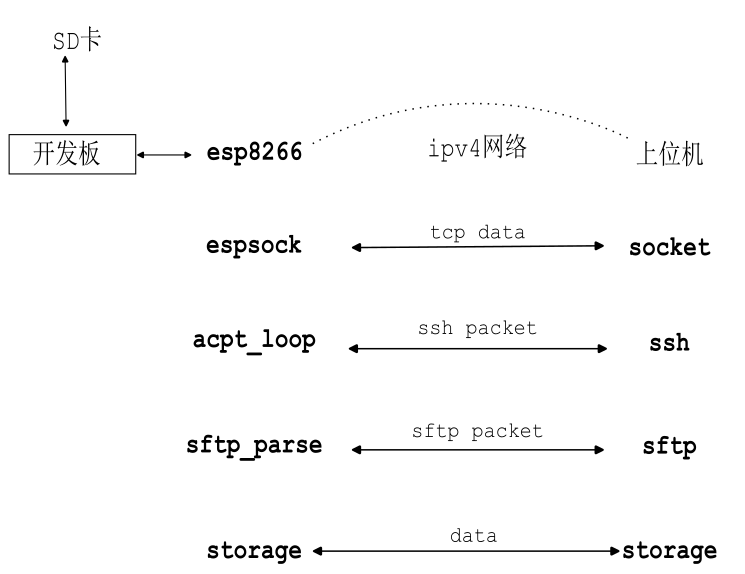
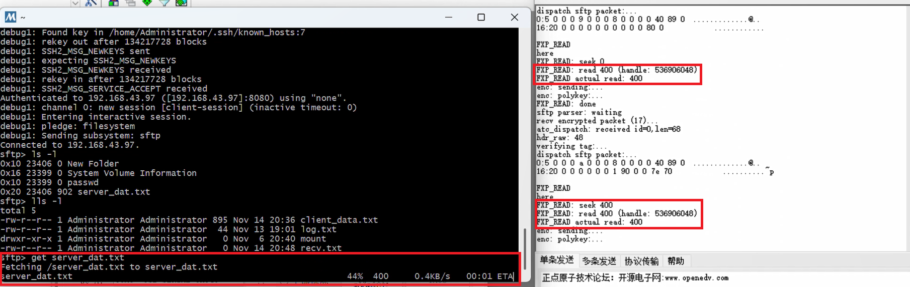
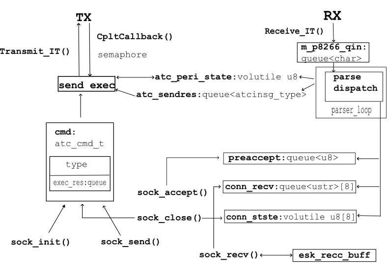
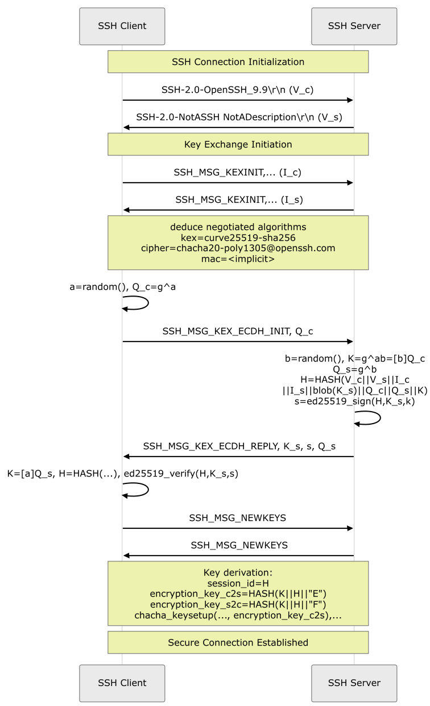
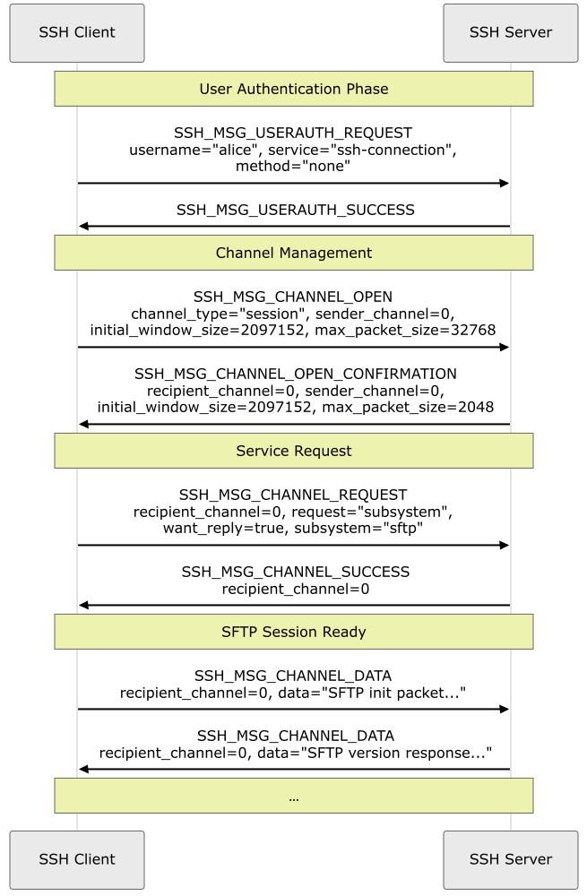

# SSH/SFTP For Embedded Systems

this project provides a code template, a ssh protocol template and sftp demonstrations, based on prechin's dev board, mcu stm32f103ze, peripherals ESP8266-1S(link with usart3), SD card(link with SDIO)

  
  

## prerequisites

only tested on the board with mcu stm32f103ze; required flash > 165KB case !USE_CRYPTO_V2 else > 48KB; ram size > 44 KB, peripherals ESP8266-1S(a module with ESP8266 chip) and SD card, mcu pins SDIO/SPI(not impl) for SD card and usart3 for ESP8266-1S

## how-to-use

compile by the .uvprojx project file, or use the free-to-use toolchain ARMCLANG from scratch

## references

3rd parties include HAL/CMISIS, FatFS, FreeRTOS, IOLIbrary(unused), with some files derived from OpenSSH. license MIT, which is compatible. see [LICENSES.md](./LICENSES.md).

harping: [readme2.md](./readme2.md), [read_esp8266.md](./read_esp8266.md), [read_freertos.md](./read_freertos.md), [read_ssh.md](./read_ssh.md)

## in this project:
layout:
- [Core](./Core/readme.md)
- Drivers: hal and cmsis
- [FatFS](./FatFS/readme.md)
- FreeRTOS: freertos source code
- IOLibrary: not in use
- [StdPort](./StdPort/readme.md)
- [User](./User/readme.md)

implementation details:

  
  
  

## bugs and todos

haven't override malloc/free for fatfs yet; 